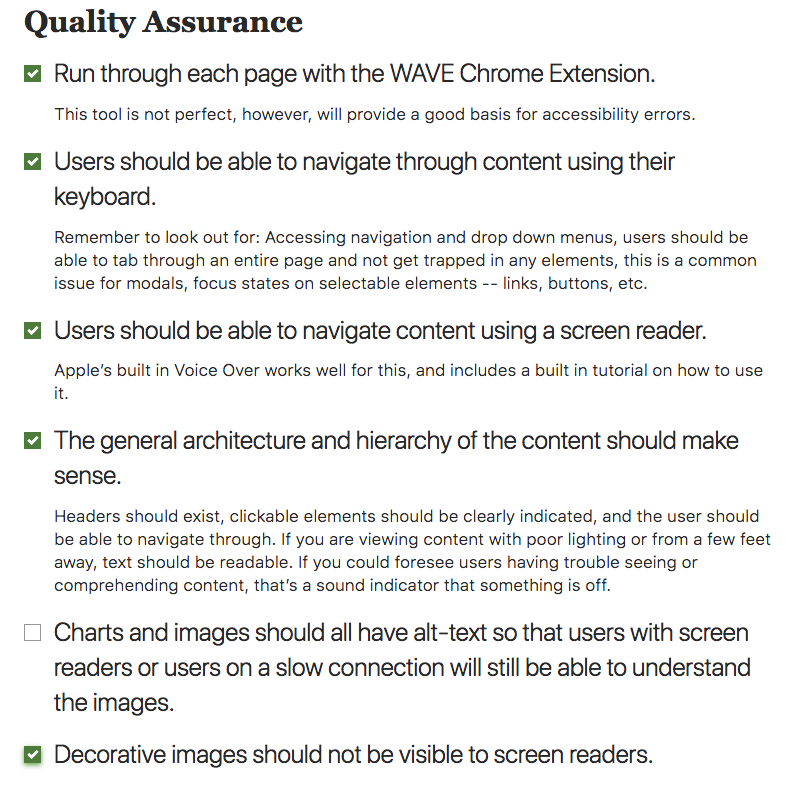

# 539 Final Project : Accessibility Checklist

## Website: https://umma.umich.edu/

For my final project, I am evaluating The University of Michigan Museum of Art's website. Below is my evaulation of the site using the Quality Assurance Vox Media Accessbility checklist. 

Though the first four items are checked, I want to make a few notes for some:

* Though I ran each page through the WAVE validator, and most pages were fine in terms of general content and HTML structure, at least 8 errors occured on all pages due to the menu (saying there was an unlinked item) and the multiple images on the page which included no alt text. Additionally, errors occured from the social icons, saying the link contained no text.

* Tabbing through the site works well, and it makes sense of how to get through each heading (there are a lot of options in the navigation however, so it was a long process getting through each link.) Furthermore, sometimes, especially towards the bottom of the page with a lot of large images/buttons, I lost visual on where the tab index was. 

* The many menu options made it a little tiresome to tab through and use the screenreader. Furthermore, since the images contain no alt text, once the screen reader made it to the images on the page, the screen reader had to read aloud the full link of the image. This was annoying and did not help me figure out what the image was with out looking at the screen. Finally, in the top menu navigation, rather than the screen reader saying "Art" while processing the first menu item, it read "A-R'-T".

## Recommendations 
To improve the quality assurance of the UMMA's site I recommend 3 key suggestions:

1. Add alternative text to all images so that screen readers can access them gracefully, rather than reading out a long link. Furthermore, alt texted is needed so if an image does not load, it is not left blank. I did apprecaite how the website avoided the scrolling carousel with an ARIA label though! 

2. As mentioned above, the screen reader had a hard time processing the social icons. I recoomend changing the format of the social icons so screen readers can see them and read aloud what they are, rather than having the user tab into the "group" in order to see what the content is. 

3. If possible, fix the "Art" heading so the screen reader actually says "Art" rather than "A-R-T". I would also recommend making the navigation a little less long and consolidate some options, if possible for the overall content of the website. 

